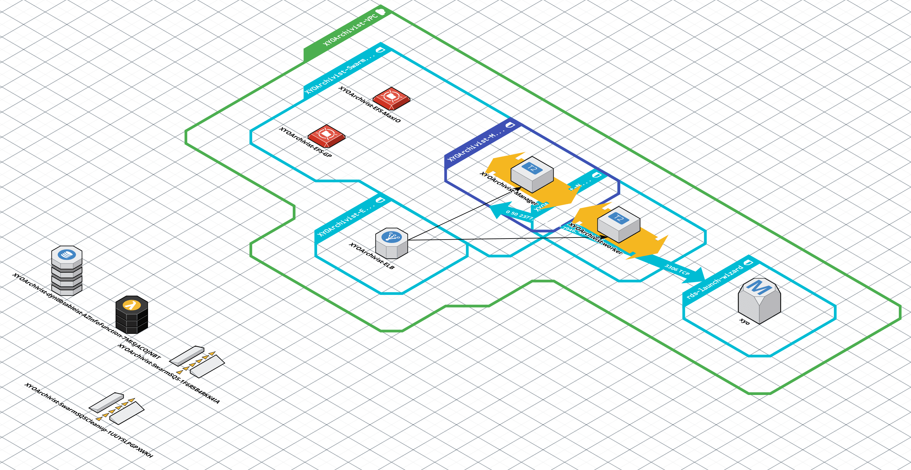
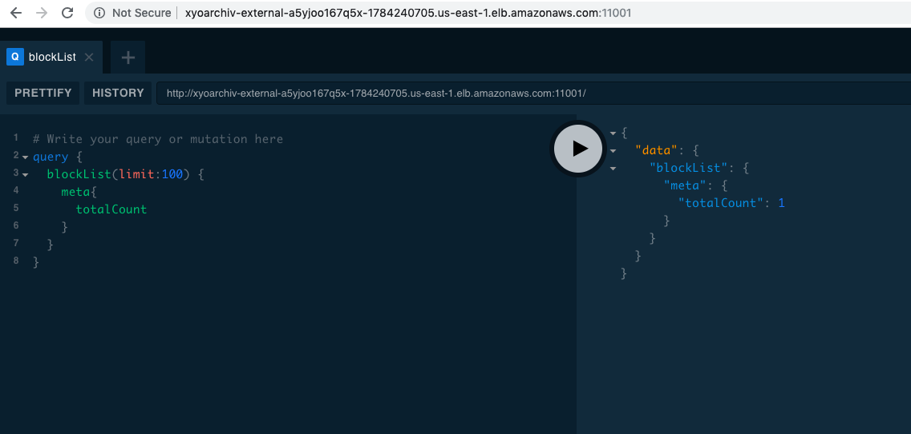

# XYO Archivist setup using AWS docker swarm 
*aka: [winter[sulgen]](https://www.cafe-landei.de/) is coming*

Geohash: [u0w8j](http://geohash.org/u0w8j:Wintersulgen), Wintersulgen lies in the beautiful Deggenhauser valley in Southern Germany (something similar to the Nappa Valley) and is in vicinity to global hubs like Zurich, Zug Crypto Valley, Friedrichshafen the birthplace of the Zeppelin and many more.

We want to use the Docker for AWS feature to spin up a complete Docker Swarm including VPC, networking etc so we oly need to worry about the archivist details.

## AWS Pre-requisites

Apart from registering an account on AWS you would need also a key pair. Go to AWS EC2 Dashboard and select Key pairs. You can either import and existing key or create a new one. Once you click create new the my-key-par.pem file will be created and downloaded to your PC. 

Use the chmod command to make sure your private key file isn't publicly viewable.

chmod 400 my-key-pair.pem

To ssh ito your manager node once the swarm is up, lookup the manager_node public dns names and ssh with below command (user is docker for dockerswarm)

ssh -i /path/my-key-pair.pem docker@public_dns_name_of_manager_node

* docker-stack.yml

As a first step I translated the instruction from [xyo](https://github.com/XYOracleNetwork/app-archivist-nodejs) into a docker swarm compose yml file. 

To create a Docker Swarm with variable amount of manager/worker nodes there is already excellent documentation [here](https://stelligent.com/2017/02/21/docker-swarm-mode-on-aws/)
Only caveat since we will be using external cloudstor volumes is to make sure the answer to Create EFS prerequisites for Cloudstor (Default is No) is selected 'YES'

Once the swarm is up you can ssh into one of the manager nodes and grep the yml file from the github repo.
* curl -O https://raw.githubusercontent.com/eoskl/xyo/master/docker-stack.yml

Then simply adjust the parameters as needed and bring up the stack with
* docker stack deploy -c docker-stack.yml xyo

## Replication, HA etc.

* docker-stack-replica.yml

mysql replication in swarm node taken from [here](http://ayoubensalem.me/tutorials/2018-04-03/Mysql-replication-in-Swarm-Mode)

## Using Amazon Relational Database Service (RDS)

The highlevel sequence of steps as follows
- Create the docker swarm. From the Outputs tab of the cloudformation screen capture the following settings. *VPCID* (to configure RDS using the same private zone) and *SwarmWideSecurityGroupID* (to allow inbound connection from the nodes to the RDS instance

- create RDS (Internal) <== uses above VPC, new Security Group
- once the RDS is up, go to the inbound security group of the RDS instance and add the rules for TCP/3306 access for the SwarmWideSecurityGroupID
- download the docker-rds.yml and update the SQL_HOST with the endpoint of the RDS service <your_instance>.rds.amazonaws.com>

## Archivist GraphQL port 11001

